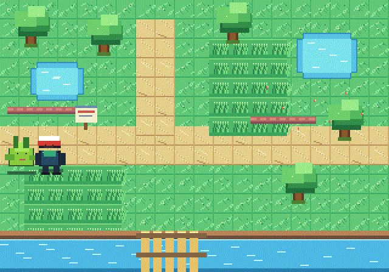

# Daten statt Bauchgefühl: Wie man das beste Pokémon-Team findet



*Wer Pokémon spielt, kennt das Problem: Vor dem nächsten Arenakampf fragt man sich, ob das eigene Team stark genug ist. Oft entscheidet man aus dem Bauch heraus oder folgt Tipps aus dem Internet. In unserem Big-Data-Projekt wollten wir genauer wissen, welche Teams in einer bestimmten Spielsituation wirklich die besten Chancen haben.*

## Wenn Bauchgefühl nicht mehr reicht

Für alle, die Pokémon nicht oder nur am Rand kennen: Am Anfang eines Spiels wählt man zuerst eines von drei Starter-Pokémon. Danach baut man im Verlauf der Reise ein Team aus bis zu sechs Pokémon auf.

Das Ziel ist, Schritt für Schritt stärker zu werden und wichtige Kämpfe zu gewinnen. In vielen Spielen tritt man zuerst gegen acht Arenaleiter an. Danach folgen die Elite Four, also vier besonders starke Kämpfe direkt hintereinander, und ganz am Ende der Champion.

Genau dadurch wird Pokémon strategisch interessanter, als es zuerst wirkt. Jedes Pokémon hat eigene Typen, Werte und Attacken. Dazu kommt, dass nicht jedes Pokémon in jedem Spiel und zu jedem Zeitpunkt überhaupt verfügbar ist.

Genau daraus entstand unsere Projektfrage:

> **Kann man mit Daten berechnen, welches Pokémon-Team für den nächsten wichtigen Kampf besonders gute Chancen hat?**

Uns interessierten also nicht einfach "starke Pokémon", sondern Teams, die in einem konkreten Spielabschnitt sinnvoll sind, zum Beispiel vor einem Arenaleiter, der Elite Four oder dem Champion.

## Ein Beispiel aus Pokémon Diamond

Besonders gut zeigen lässt sich das an **Pokémon Diamond**. In diesem Spiel kämpft man sich durch acht Arenen, später durch die Elite Four und am Ende gegen Champion Cynthia. Für Spielende ist das immer wieder dieselbe Situation: Vor dem nächsten wichtigen Kampf muss man entscheiden, welche sechs Pokémon man mitnimmt. Ein reines Pflanzen-Team, das gegen eine Wasser-Arena hervorragend funktioniert, ist in einer Feuer-Arena viel schwächer.

Genau dafür haben wir einen **Walkthrough Commander** gebaut. Dort wählt man ein Spiel und den eigenen Starter aus. Danach zeigt die Seite für jeden wichtigen Kampf, welche Teams unter unseren Annahmen die besten Siegchancen haben.

**Abbildung 1** zeigt genau so einen Fall: Die Empfehlung bezieht sich nicht allgemein auf Pokémon Diamond, sondern auf einen ganz bestimmten Moment im Spiel. Entscheidend ist also immer die konkrete Situation. Das Bild macht damit sichtbar, worauf unser Projekt hinauswill: nicht ein einziges "perfektes" Team zu finden, sondern für den nächsten wichtigen Kampf eine möglichst passende Empfehlung zu geben.


*Abbildung 1: Der Walkthrough Commander zeigt passende Team-Empfehlungen für den jeweiligen Spielabschnitt.*

## Aus vielen Quellen wurde ein Gesamtbild

Damit so eine Empfehlung überhaupt möglich ist, mussten wir Daten aus mehreren Quellen zusammenführen:

- **[Bulbapedia](https://bulbapedia.bulbagarden.net/)** für Spielverlauf, Orte und Gegner
- **[PokeAPI](https://pokeapi.co/)** für Pokémon, Typen und Attacken
- **[Kaggle](https://www.kaggle.com/)** für Teams von Arenaleitern, Elite Four und Champions

Die eigentliche Schwierigkeit war nicht das Finden der Daten, sondern das Zusammenpassen. Ein Gegner aus einer Quelle musste mit dem richtigen Team aus einer anderen Quelle und den passenden Pokémon-Daten aus einer dritten Quelle verbunden werden. Das klingt unspektakulär, war aber zentral. Wenn Namen, Orte oder Spielversionen nicht sauber zusammenpassen, werden auch die Empfehlungen unzuverlässig.

## Wie gross das Ganze wurde

Aus dem vermeintlich kleinen Spielprojekt wurde schnell ein recht grosses Datenprojekt. Insgesamt verarbeiteten wir Daten aus **12 Pokémon-Spielen** der Generationen I bis VI.

Dabei kamen unter anderem zusammen:

- **176 wichtige Boss-Kämpfe**
- **451 fangbare Pokémon**
- **412 Attacken**
- **520 Orte und Routen**
- **18 Typen** mit ihren Stärken und Schwächen

Diese Zahlen sind nicht nur eine technische Randnotiz. Sie zeigen vor allem, warum die Teamfrage schnell unübersichtlich wird. Schon wenn man einige sinnvolle Pokémon und deren Attacken miteinander kombiniert, entstehen sehr viele mögliche Teams.

Für Spielende bedeutet das: Was sich im Spiel wie eine spontane Bauchentscheidung anfühlt, ist in Wirklichkeit eine Auswahl aus sehr vielen Varianten. Genau deshalb lässt sich die Frage nach dem "besten Team" nicht sinnvoll nur aus Erfahrung beantworten. Man muss viele Möglichkeiten systematisch vergleichen.

## Wie wir Kämpfe berechnet haben

Das Herzstück des Projekts war unsere Kampfsimulation. Die Idee dahinter ist einfach:

Ein Team kämpft nicht nur einmal gegen einen Gegner, sondern sehr oft. So erhält man nicht bloss ein einzelnes Resultat, sondern eine realistischere Schätzung der Siegchance.

Ein einfaches Beispiel:

```text
500 simulierte Kämpfe
450 Siege
= 90 % Siegquote
```

Diese Zahl ist aussagekräftiger als ein einzelner Testkampf. Denn in Pokémon hängt viel vom konkreten Ablauf ab: Wer greift zuerst an? Welche Attacke wird eingesetzt? Welche Typenvorteile kommen zum Tragen? Darum wollten wir nicht nur wissen, **ob** ein Team gewinnen kann, sondern **wie zuverlässig** es gewinnt.

## Warum Typen fast alles verändern

Wer Pokémon kennt, weiss: Typen entscheiden oft über Sieg oder Niederlage. Feuer ist stark gegen Pflanze, Wasser gegen Feuer und Elektro gegen Wasser. Spannend wird es bei Pokémon mit zwei Typen. Dann müssen beide zusammen betrachtet werden. Ein Elektro-Angriff ist zum Beispiel stark gegen Wasser, hat gegen Boden aber keine Wirkung. Gegen ein Wasser/Boden-Pokémon bringt Elektro deshalb insgesamt nichts.

```text
Elektro gegen Wasser/Boden
= stark gegen Wasser --> der Angriff wäre eigentlich besonders wirksam
= keine Wirkung gegen Boden --> dadurch fällt der Angriff komplett weg
= insgesamt keine Wirkung
```

Gerade deshalb ist eine datenbasierte Auswertung nützlich. Ein Team kann in einem Kampf sehr stark sein und im nächsten deutlich schlechter abschneiden, obwohl es auf den ersten Blick ähnlich gut wirkt.

## Ein Team für einen Kampf ist nicht automatisch gut für alle

Besonders deutlich wurde das bei der **Elite Four** und beim **Champion**. Dort reicht es nicht, für einen einzigen Gegner gut vorbereitet zu sein. Ein Team muss mehrere starke Kämpfe hintereinander überstehen. Darum betrachteten wir nicht nur einzelne Duelle, sondern auch ganze Serien von Kämpfen. So wurde sichtbar, ob ein Team nur gegen einen bestimmten Gegner stark ist oder ob es über mehrere Kämpfe hinweg zuverlässig funktioniert. Das ist ein wichtiger Unterschied: Das beste Team für die nächste Arena ist nicht automatisch auch das beste Team für das Ende des Spiels.

## Was man aus den Ergebnissen mitnehmen kann

Die wichtigste Erkenntnis war: **Das beste Pokémon-Team gibt es nicht allgemein, sondern nur im jeweiligen Kontext.**

Ob ein Team sinnvoll ist, hängt zum Beispiel davon ab:

- gegen wen man als Nächstes kämpft
- welche Typen dort wichtig sind
- welche Pokémon man zu diesem Zeitpunkt überhaupt fangen kann
- welchen Starter man am Anfang gewählt hat

Genau hier hilft die Auswertung. Statt nur zu sagen "dieses Team fühlt sich stark an", konnten wir zeigen, wie häufig ein Team unter denselben Bedingungen tatsächlich gewinnt.

Ein konkretes Beispiel sieht man bereits in **Abbildung 1**: Der Walkthrough Commander zeigt nicht einfach irgendein Lieblings-Team, sondern eine Empfehlung für einen ganz bestimmten Spielabschnitt. Genau das war eines der wichtigsten Ergebnisse unseres Projekts. Die Empfehlung hängt davon ab, **wo** man im Spiel steht und **welche Optionen** zu diesem Zeitpunkt überhaupt realistisch sind.

Das heisst auch: Ein Team, das früher im Spiel sehr stark wirkt, muss später nicht mehr die beste Wahl sein. Der Nutzen des Projekts liegt also weniger darin, "das eine perfekte Team" zu finden, sondern für den nächsten wichtigen Kampf eine begründete Empfehlung zu geben.

Die Empfehlungen sind trotzdem keine perfekte Vorhersage für jeden echten Spielverlauf. Bestimmte Spielmechaniken haben wir vereinfacht, etwa sehr spezielle Kampfsituationen oder Hilfsmittel wie Items. Die Resultate sind deshalb am besten als **Orientierung** zu verstehen, nicht als Garantie.

## Auch der Starter macht einen Unterschied

Ein spannender Punkt war die Wahl des Starter-Pokémon. Je nachdem, ob man sich am Anfang für Pflanze, Feuer oder Wasser entscheidet, verändert sich der weitere Spielverlauf teilweise leicht. Das eigene Team entwickelt sich anders, und in manchen Spielen wirken sich diese Entscheidungen sogar indirekt auf spätere Gegner aus. Deshalb kann sich auch die Empfehlung ändern. Mit anderen Worten: Selbst innerhalb desselben Spiels gibt es nicht nur eine einzige richtige Lösung.

## Was im Projekt besonders schwierig war

Die grösste Herausforderung war nicht nur die Simulation selbst, sondern vor allem die Frage, wie man die Spielwelt fair und glaubwürdig in Daten übersetzt.

Schwierig waren vor allem diese Punkte:

- **Daten zusammenführen:** Die verschiedenen Quellen passten nicht automatisch zusammen.
- **Verfügbarkeit im Spiel:** Ein Pokémon ist nur dann eine sinnvolle Empfehlung, wenn man es zu diesem Zeitpunkt auch wirklich bekommen kann.
- **Realistische Regeln:** Sehr starke Sonderfälle wie legendäre oder besonders seltene Pokémon wollten wir ausschliessen, damit die Vorschläge spielnah bleiben. Zudem richteten wir uns am Level der Bosse, was für Attacken und verfügbare Pokémon wichtig ist.
- **Rechenaufwand:** Sobald viele Teams und Attacken verglichen werden, wächst die Zahl der Möglichkeiten sehr schnell.

Gerade diese Punkte haben gezeigt, dass hinter einer scheinbar einfachen Empfehlung überraschend viel Detailarbeit steckt.

## Fazit

Unser Projekt zeigt, dass selbst eine bekannte Spielwelt wie Pokémon spannende Datenfragen aufwirft. Aus verschiedenen Quellen, vielen Berechnungen und unzähligen Teamvarianten entstanden konkrete Empfehlungen für reale Spielsituationen.

Für uns war die wichtigste Erkenntnis: Daten können Spielentscheidungen nicht ersetzen, aber sie können sie deutlich besser begründen.

Oder kürzer gesagt:

> **Pokémon bleibt ein Spiel, aber eines mit erstaunlich viel Strategie.**

## Ausblick

Spannend wäre als Nächstes vor allem, noch mehr Spiele einzubeziehen und die Ergebnisse noch einfacher zugänglich zu machen. Statt einer statischen Seite könnte daraus später ein interaktives Werkzeug werden, das Spielenden direkt bei der Teamwahl hilft. So würde aus dem Projekt langfristig ein praktischer Pokémon-Berater entstehen: nicht für das perfekte Spielen, eher als Unterstützung beim Team-Building.

*Erstellt im Rahmen des Moduls DS.PM4 an der ZHAW, Studiengang Data Science.*
