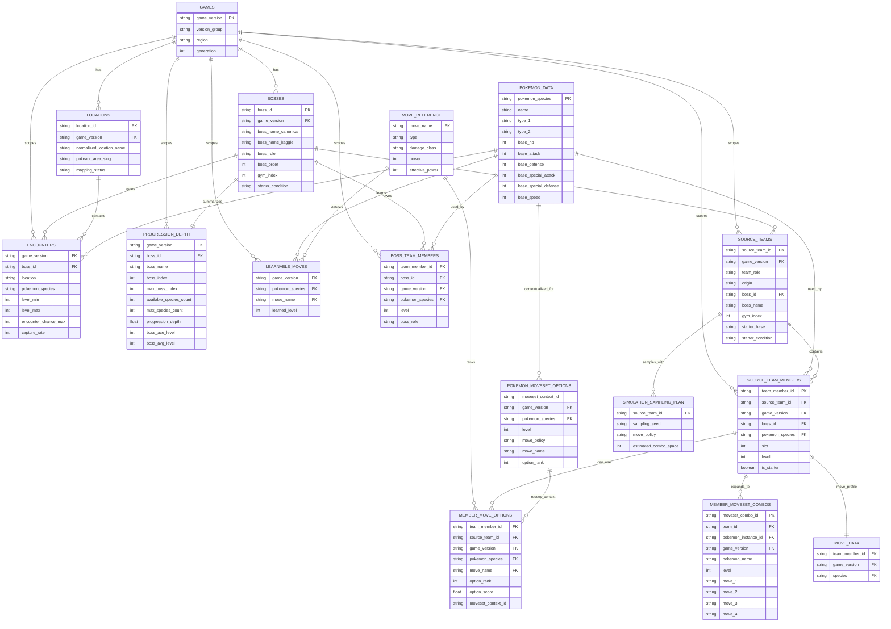

# Silver Layer

The Silver layer transforms raw Bronze payloads into cleaned, mapped, and enriched datasets.

## Purpose

- Parse walkthrough progression into structured boss snapshots.
- Map walkthrough locations to PokeAPI slugs and reachable Pokemon.
- Harmonize bosses with Kaggle-compatible naming for team joins.
- Produce normalized Silver artifacts and references for analytics and simulation.

## Entrypoint

- Function: `build_silver_from_bronze`
- File: `src/pipeline/silver/orchestration/build_silver.py`
- Orchestration: `src/pipeline/run_pipeline.py` (`all` or `layers silver`)

## Required Inputs

- `data/bronze/pokeapi/location_index.json`
- `data/bronze/bulbapedia/*.json`
- Optional enrichment input: `data/bronze/kagglehub/gym_leaders_elite_four.csv`

If required Bronze files are missing, the layer raises `FileNotFoundError`.

## Core Processing

1. Validate Bronze input presence and load game configs.
2. Parse each game walkthrough into boss progression records (`extract_game_data`).
3. Enrich boss records using Kaggle harmonization (`enrich_boss_records`).
4. Resolve location area and Pokemon availability maps from PokeAPI.
5. Enrich records with location Pokemon/encounter details.
6. Write per-game normalized snapshot files.
7. Build reference artifacts:
   - Pokemon reference index
   - Encounter methods reference
   - Boss mapping by version
   - Unmapped location diagnostics (detailed, summary, compact)
8. Extract compact team and move-option inputs from Kaggle + references:
   - Team templates (`source_teams`)
   - Team members (`source_team_members`)
   - Per-member move-set combinations (`member_moveset_combos`)
   - Ranked move options (`member_move_options`, optional compatibility table)
   - Reusable move-option contexts (`pokemon_moveset_options`)
   - Separate move metadata (`move_data` / `move_reference` / `learnable_moves`)
9. Generate Silver manifest.

## Silver Manifest Contract for Gold

`data/silver/manifest.json` ist der einzige vertragliche Input fuer Gold.

Der Manifest enthaelt dafuer:

- `contracts.gold_strict.required_dataset_keys`
- `datasets.boss_records.files[]`
- `datasets.simulation_inputs_teams.file`
- `datasets.source_team_members.file`
- `datasets.member_moveset_combos.file` (or sharded `files[]`)

Fehlende oder inkonsistente Eintraege fuehren in Gold zu einem sofortigen Laufabbruch (fail-fast).

## Outputs

Primary outputs in `data/silver/`:

- `snapshots/{game_key}_boss_snapshots.jsonl`
- `mappings/location_to_area_map.json`
- `mappings/location_to_pokemon_map.json`
- `mappings/boss_mapping_by_version.json`
- `references/pokemon_reference.parquet`
- `references/encounter_methods_reference.json`
- `references/encounters.jsonl`
- `diagnostics/unmapped_locations_detailed.json`
- `diagnostics/unmapped_locations_summary.json`
- `diagnostics/unmapped_locations.json`
- `diagnostics/relational_validation.json`
- `manifest.json`

Normalized reference/fact tables in `data/silver/references/`:

- `games.parquet`
- `bosses.parquet`
- `locations.parquet`
- `encounters.parquet`
- `snapshot_available_pokemon.parquet`
- `move_reference.parquet`
- `learnable_moves.parquet`

Team tables in `data/silver/simulation/`:

- `simulation/source_teams.parquet` (logical source teams only)
- `simulation/teams.jsonl` (optional materialized preview)
- `simulation/source_team_members.parquet` (one row per logical team slot)
- `simulation/member_moveset_combos.parquet` (one row per member combo, up to `C(candidate_moves,4)` or cap)
- `simulation/member_move_options.parquet` (optional compatibility: one row per legal move option, ranked)
- `simulation/pokemon_moveset_options.parquet` (reusable per-species/level/game move options)
- `simulation/move_data.parquet` (detailed move info: power, damage_class per move)

## ERD

The Silver layer is split into:

- reference tables in `data/silver/references/`
- simulation input tables in `data/silver/simulation/`



### Relationship Notes

- `bosses.parquet` is the canonical boss dimension for both progression and simulation joins.
- `encounters.parquet` links a boss step to the wild species available before that boss.
- `progression_depth.parquet` is a derived per-boss fact used to bound player team generation.
- `source_teams_*.parquet` and `source_team_members_*.parquet` are the main Gold-facing team contracts.
- `member_moveset_combos_*.parquet` stores bounded per-member move combinations, not full team Cartesian products.
- `move_data.parquet`, `move_reference.parquet`, and `learnable_moves.parquet` together define the combat move layer.

**Source Team Structure (compact)**:
```json
{
  "team_id": "KAGGLE_red_brock_0",
  "game_version": "red",
  "pokemon": ["geodude", "onix"],
  "levels": [12, 14],
  "moves": [["rock-throw", "defense-curl"], ["bind", "rock-throw"]],
  "avg_level": 13,
  "team_role": "boss",
  "boss_name": "Brock",
  "is_player_candidate": false
}
```

**Move Data Structure** (stored separately in `move_data.parquet`):
```javascript
{
  "red:geodude:12": {
    "species": "geodude",
    "level": 12,
    "game_version": "red",
    "provided_moves": ["rock-throw", "defense-curl"],
    "learnable_moves": ["rock-throw", "defense-curl", "magnitude", "bulldoze"],
    "move_details": {
      "rock-throw": {"power": 50, "damage_class": "physical"},
      "defense-curl": {"power": 0, "damage_class": "status"}
    }
  }
}
```

Gold consumes the Silver simulation inputs and writes the battle matrix, seeds, and Monte-Carlo outputs into `data/gold/simulation/`.

Validate Gold simulation artifacts after a full run:

- `PYTHONPATH=src python -m src.pipeline.run_pipeline validate-simulation`

## Notes and Constraints

- Location mapping quality is measurable via unmapped diagnostics.
- Kaggle enrichment improves joinability but does not overwrite canonical boss identity keys.
- Silver keeps a balance between normalized references and per-game snapshots.
- Silver intentionally does not materialize full team/move-set Cartesian variants.
- Old (bad): `team × member1_movesets × ... × member6_movesets`
- New (compact): `team`, `team_members`, `member_moveset_combos` (Gold builds bounded `simulation_samples`)
- Gold/simulation performs bounded deterministic expansion/sampling from compact Silver options.
- Silver validiert FK/PK-Beziehungen über normalisierte Tabellen und bricht bei Fehlern ab.
